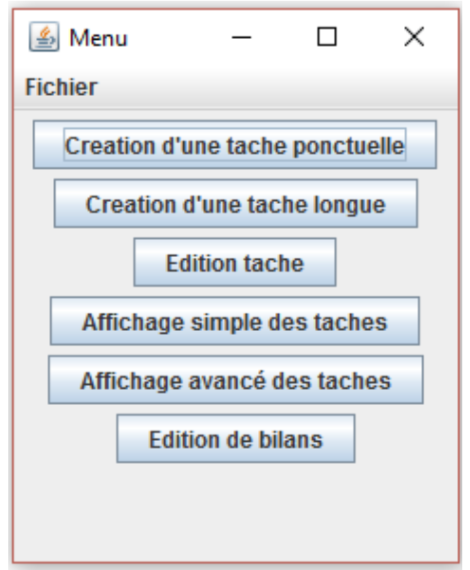

Realization: Application to create a task (punctual or long), edit it and display the list of tasks. Done in JAVA during my third year of bachelor.

Objective:

Make a small application to manage the tasks of a person like a "todolist".

Note: The work could be improved by performing tests with JUnit
